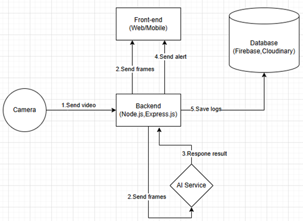
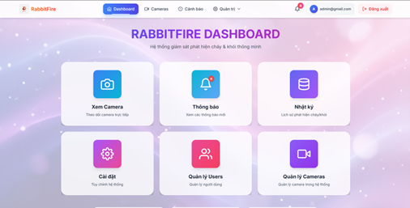
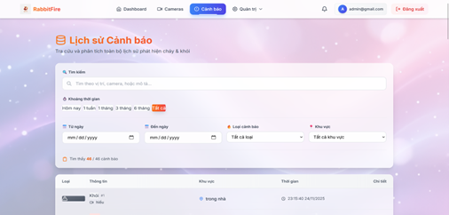
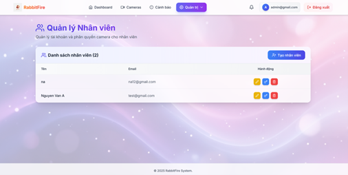
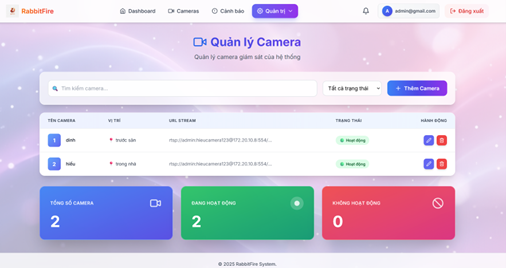
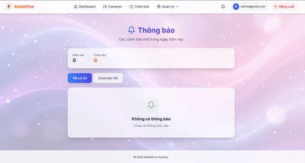
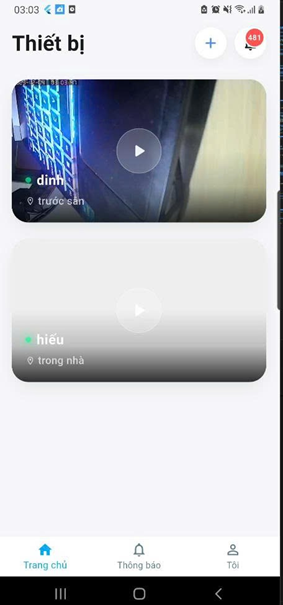
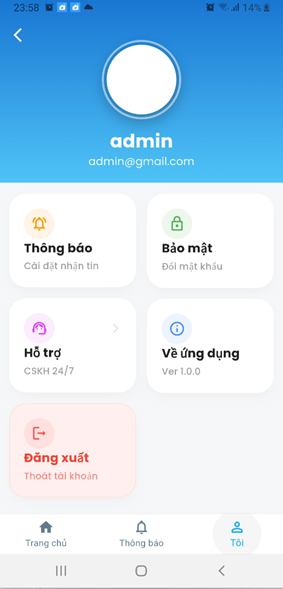
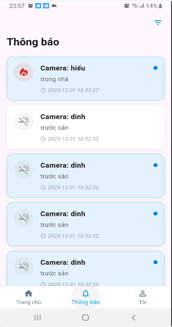

---

# 🐰 RABBITFIRE: HỆ THỐNG GIÁM SÁT & PHÁT HIỆN CHÁY KHÓI THÔNG MINH

**RabbitFire** là một giải pháp an ninh tích hợp AI (Deep Learning) nhằm phát hiện sớm các dấu hiệu hỏa hoạn và khói từ Camera giám sát. Hệ thống không chỉ nhận diện mà còn tự động hóa quy trình cảnh báo đa nền tảng, lưu trữ bằng chứng và quản lý thiết bị tập trung.

---

## 🏗️ 1. KIẾN TRÚC HỆ THỐNG (SYSTEM ARCHITECTURE)

Hệ thống hoạt động theo mô hình **Client-Server-Worker** phân tán để tối ưu hóa hiệu năng:

* **AI Engine (YOLOv8/v11):** Nhận hình ảnh nhị phân (Buffer) và thực hiện phân tích đối tượng với độ chính xác cao.
* **Central Backend (Node.js/Express):** Đóng vai trò là "Hub" trung tâm, điều phối toàn bộ API, quản lý Firebase Firestore và xử lý luồng Media (FFmpeg).
* **Worker Node (Edge Computing):** Chạy độc lập trên các máy trạm để lấy frame từ Backend và đẩy sang AI, giúp hệ thống có thể mở rộng (Scale) thêm hàng trăm camera mà không làm treo server chính.
* **Cross-Platform Clients:** Bao gồm Web Dashboard (quản lý tập trung) và Mobile App (giám sát di động và nhận thông báo khẩn).
### Kiến trúc tổng quan



---

## 💻 2. CHI TIẾT CÁC THÀNH PHẦN (COMPONENT DEEP-DIVE)

### 📂 A. Backend & Worker Node (Điều khiển & Xử lý)

Đây là phần cốt lõi quản lý logic nghiệp vụ và hạ tầng dữ liệu.

* **Xử lý Media (`streamFrame.js`, `detect.js`):**
* Sử dụng **FFmpeg** để giải mã luồng RTSP từ IP Camera.
* **Cơ chế Caching:** Lưu URL camera vào RAM để tránh truy vấn Firestore liên tục, giảm độ trễ tối đa.


* **Quản lý Cảnh báo (`alerts.js`, `alertsWs.js`):**
* **Giai đoạn 1 (Early Warning):** Gửi tín hiệu WebSocket (WS) ngay khi AI báo có cháy.
* **Giai đoạn 2 (Persistent Alert):** Upload ảnh lên **Cloudinary**, gửi thông báo **FCM (Push Notification)** cho người dùng và lưu vào lịch sử Firestore.


* **Worker (`worker.js`):** Thực hiện vòng lặp `captureFrame` -> `sendToDetector` với chu kỳ có thể tùy chỉnh (mặc định 1s/frame) để cân bằng giữa độ nhạy và tài nguyên CPU.

### 🌐 B. Web Dashboard (Quản trị & Giám sát Desktop)

Giao diện hiện đại sử dụng ngôn ngữ thiết kế Glassmorphism (Kính mờ).

* **Live Stream (`Cameras.jsx`):** Hỗ trợ xem đa luồng với các Layout 1, 4, 9 ô. Sử dụng thẻ ảnh nạp luồng MJPEG từ Backend giúp xem mượt mà trên trình duyệt.
* **Quản lý Admin (`adminRoutes.js`):** Cho phép Admin hệ thống tạo tài khoản nhân viên, quản lý quyền truy cập và cấu hình danh sách camera toàn hệ thống.
* **Nhật ký sự cố (`AlertsPage.jsx`):** Bộ lọc nâng cao theo thời gian thực, cho phép tra cứu lịch sử sự cố theo vị trí, loại (lửa/khói) và xem lại hình ảnh bằng chứng.

### 📱 C. Mobile App (Ứng dụng Flutter)

Tập trung vào tính di động và khả năng phản ứng nhanh.

* **Cinematic View (`CameraStreamScreen.dart`):** Chế độ xem Full màn hình với hiệu ứng mờ kính, hiển thị Badge "LIVE" nhấp nháy và thông tin vị trí.
* **Thông báo khẩn:** Tích hợp sâu với Firebase Messaging. Người dùng có thể nhấn vào thông báo để mở thẳng trang chi tiết sự cố (`UI_alert_detail.dart`).
* **Bảo mật:** Hỗ trợ đổi mật khẩu trực tiếp trên App và xác thực đa lớp qua Firebase Auth.

---

## 📡 3. LUỒNG DỮ LIỆU CẢNH BÁO (ALERTS DATA FLOW)

1. **Detection:** Worker gửi Frame ảnh sang AI -> Kết quả trả về `fire_detected: true`.
2. **Early Broadcast:** Backend gọi `broadcastAlertToCameraUsers` để rung chuông trên tất cả các thiết bị đang mở App/Web.
3. **Storage:** Ảnh được đẩy lên Cloudinary -> Nhận URL -> Lưu bản ghi vào Firestore sub-collection `users/{uid}/alerts`.
4. **Notification:** Firebase Cloud Messaging gửi tin nhắn đến Token thiết bị của người dùng (Tiêu đề: 🚨 CẢNH BÁO CHÁY).

---

## 🛠️ 4. HƯỚNG DẪN CÀI ĐẶT CHI TIẾT (DEPLOYMENT GUIDE)

### Bước 1: Cấu hình Firebase & Cloudinary

1. Tạo project Firebase, tải file `serviceAccountKey.json` bỏ vào thư mục `backend/firebase`.
2. Bật Cloud Firestore, Authentication và Cloud Messaging.
3. Lấy API Key từ Cloudinary để cấu hình lưu trữ ảnh.

### Bước 2: Cài đặt Backend & Worker

```bash
# Cài đặt FFmpeg trên máy chủ (Ubuntu)
sudo apt update && sudo apt install ffmpeg

# Cấu hình file .env
# PORT, FIREBASE_API_KEY, ADMIN_UID, WORKER_SECRET, CLOUDINARY_URL

# Chạy Backend
cd backend && npm install && npm start

```

### Bước 3: Triển khai Worker (Có thể chạy trên nhiều máy)

```bash
cd worker && npm install
node worker.js

```

### Bước 4: Khởi chạy Client

* **Web:** `npm run dev` (Yêu cầu Node v18+).
* **Mobile:** `flutter run` (Yêu cầu Flutter SDK và giả lập Android/iOS).

---

## ⚠️ 5. LƯU Ý VẬN HÀNH

* **Bảo mật:** `WORKER_SECRET` phải đồng bộ giữa Backend và Worker để xác thực quyền lấy luồng stream.
* **Hiệu năng:** Nếu CPU quá tải, hãy điều chỉnh `WORKER_FPS` trong `streamFrame.js` xuống mức 1 hoặc 2.
* **Mạng:** Đảm bảo link RTSP của Camera có thể truy cập được từ máy chủ chạy Backend.

---
## Giao diện hệ thống RabbitFire (Web Dashboard)

### Giao diện Dashboard tổng quan hệ thống RabbitFire



### Giao diện xem camera thời gian thực


### Giao diện lịch sử cảnh báo



### Giao diện quản lý nhân viên



### Giao diện quản lý Camera



### Giao diện danh sách thông báo




## Giao diện hệ thống RabbitFire (Mobile App)

### Giao diện camera trên Mobile



### Giao diện màn hình thông tin cá nhân của người dùng




### Giao diện màn hình danh sách thông báo  trên Mobile

